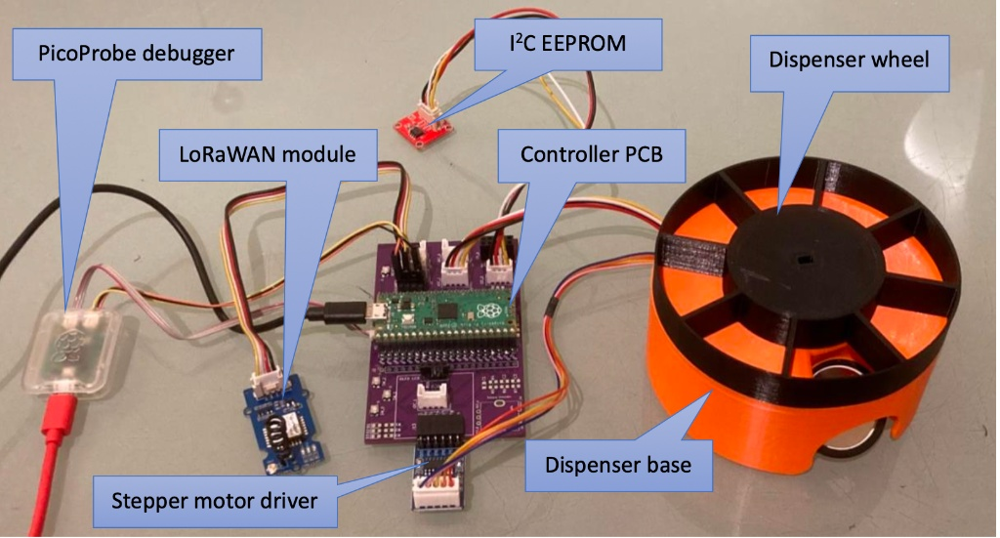

# IoT Automated Pill Dispenser (RP2040 & LoRaWAN)

##  Project Overview
A mission-critical medical IoT device developed using **C** on the **Raspberry Pi Pico**. This system automates daily medication dispensing, ensuring patient adherence through integrated sensors and long-range cloud reporting.

##  Key Technical Implementations
* **System Reliability**: Built a **Finite State Machine (FSM)** to manage complex logic (Calibration -> Wait -> Dispense -> Log).
* **Hardware Drivers**: Developed low-level drivers for **28BYJ-48 stepper motors** and handled real-time signal processing for **piezoelectric sensors** (pill drop detection).
* **Data Persistence**: Integrated **I2C EEPROM** to store device states (pills left, logs), ensuring the device recovers accurately after power loss.
* **IoT Connectivity**: Implemented **LoRaWAN (OTAA)** communication to report status changes (boot, successful dispense, error alerts) to a remote server.

##  Hardware Stack
* **Microcontroller**: Raspberry Pi Pico (RP2040)
* **Connectivity**: LoRa-E5 module
* **Sensors**: Optical (Homing), Piezo (Detection)
* **Memory**: I2C EEPROM
