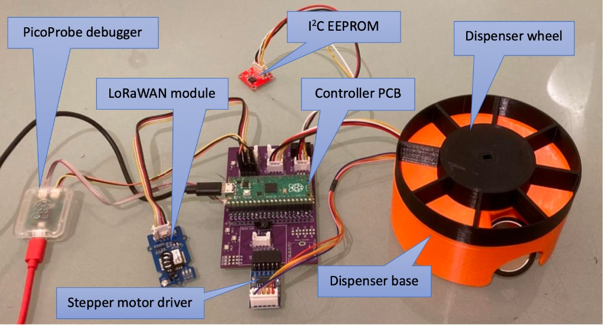

# IoT Automated Pill Dispenser

A Raspberry Pi Pico course project built in C, with LoRaWAN connectivity for remote status reporting.

## Overview

The system uses a stepper motor to dispense pills, an optical sensor to find the mechanism's home position, and a piezoelectric sensor to detect pill drops. Device state is saved in EEPROM so dispensing can resume after a restart.

## Main Features

- **Dispensing control:** A finite state machine manages calibration, waiting, dispensing and logging.
- **Motor and sensor control:** Drives a 28BYJ-48 stepper motor, uses an optical sensor for homing, and processes piezoelectric sensor signals to detect pill drops.
- **State storage:** Saves the remaining pill count and logs in I2C EEPROM, allowing the system to restore its saved state after a power interruption.
- **Remote reporting:** Uses a LoRa-E5 module with LoRaWAN OTAA to send startup messages, dispensing results and error alerts to a remote server.

## Hardware

- Raspberry Pi Pico (RP2040)
- 28BYJ-48 stepper motor
- LoRa-E5 module
- Optical sensor for homing
- Piezoelectric sensor for pill detection
- I2C EEPROM
